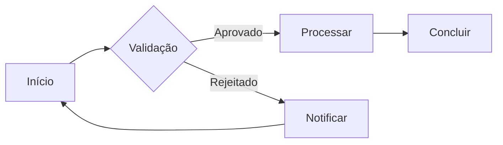

# Funcionalidades

Conheça todas as funcionalidades disponíveis no sistema.

## 📊 Dashboard

O dashboard principal oferece uma visão geral completa:

### Widgets Disponíveis

- **Métricas em Tempo Real**: Acompanhe KPIs importantes
- **Gráficos Interativos**: Visualize dados de forma intuitiva
- **Atividades Recentes**: Histórico de ações
- **Notificações**: Alertas e avisos importantes
- **Atalhos Rápidos**: Acesso rápido às funções mais usadas

### Personalização

Você pode personalizar seu dashboard:

1. Clique em "Editar Dashboard"
2. Arraste widgets para reorganizar
3. Adicione ou remova componentes
4. Salve seu layout

## 📁 Gerenciamento de Dados

### Importação

Importe dados de diferentes fontes:

```bash
# Formatos suportados
- CSV
- Excel (.xlsx, .xls)
- JSON
- XML
```

**Como importar**:

1. Acesse **Dados** > **Importar**
2. Selecione o arquivo
3. Mapeie os campos
4. Valide os dados
5. Confirme a importação

### Exportação

Exporte dados em múltiplos formatos:

| Formato | Uso | Tamanho Máximo |
|---------|-----|----------------|
| CSV | Planilhas | 100 MB |
| Excel | Relatórios | 50 MB |
| PDF | Documentos | 20 MB |
| JSON | APIs | 100 MB |

## 🔍 Busca Avançada

### Filtros

Use filtros para refinar sua busca:

- **Por data**: Período específico
- **Por categoria**: Tipo de registro
- **Por status**: Estado atual
- **Por usuário**: Responsável

### Operadores de Busca

```
# Exemplos de busca
"texto exato"           # Busca exata
palavra1 AND palavra2   # Ambas as palavras
palavra1 OR palavra2    # Qualquer uma
-palavra                # Excluir palavra
campo:valor             # Busca em campo específico
```

## 📈 Relatórios

### Tipos de Relatórios

#### Relatórios Padrão

- **Resumo Executivo**: Visão geral do período
- **Análise Detalhada**: Dados completos
- **Comparativo**: Comparação entre períodos
- **Tendências**: Análise de tendências

#### Relatórios Personalizados

Crie seus próprios relatórios:

1. Acesse **Relatórios** > **Novo Relatório**
2. Selecione os dados
3. Escolha visualizações
4. Configure filtros
5. Salve e compartilhe

### Agendamento

Agende relatórios automáticos:

```javascript
{
  "nome": "Relatório Mensal",
  "frequencia": "mensal",
  "dia": 1,
  "horario": "08:00",
  "destinatarios": ["email@exemplo.com"],
  "formato": "PDF"
}
```

## 🔔 Automações

### Criar Automação

Configure ações automáticas:

**Exemplo: Notificação Automática**

```
SE novo_registro ENTÃO
  enviar_email(destinatario, template)
  criar_tarefa(responsavel, prazo)
  atualizar_status(status)
FIM
```

### Triggers Disponíveis

- Novo registro criado
- Registro atualizado
- Status alterado
- Data específica atingida
- Condição personalizada

## 👥 Colaboração

### Compartilhamento

Compartilhe dados com sua equipe:

1. Selecione o item
2. Clique em "Compartilhar"
3. Adicione usuários ou grupos
4. Defina permissões:
   - **Visualizar**: Apenas leitura
   - **Editar**: Modificar dados
   - **Gerenciar**: Controle total

### Comentários

Adicione comentários e menções:

```
@usuario Revise este registro, por favor!
#importante #urgente
```

### Histórico de Versões

Acompanhe todas as alterações:

- Quem alterou
- Quando alterou
- O que foi alterado
- Restaurar versão anterior

## 🔐 Controle de Acesso

### Permissões por Módulo

Configure acesso granular:

| Módulo | Admin | Gerente | Usuário |
|--------|-------|---------|---------|
| Dashboard | ✅ | ✅ | ✅ |
| Relatórios | ✅ | ✅ | 👁️ |
| Configurações | ✅ | ⚠️ | ❌ |
| Usuários | ✅ | ❌ | ❌ |

Legenda:
- ✅ Acesso total
- 👁️ Apenas visualização
- ⚠️ Acesso limitado
- ❌ Sem acesso

## 📱 Aplicativo Mobile

### Recursos Mobile

O app mobile oferece:

- Sincronização offline
- Notificações push
- Scanner de documentos
- Geolocalização
- Assinatura digital

### Download

- [iOS - App Store](https://apps.apple.com/app/seu-app)
- [Android - Play Store](https://play.google.com/store/apps/seu-app)

## 🎨 Customização

### Campos Personalizados

Adicione campos customizados:

1. Acesse **Configurações** > **Campos Personalizados**
2. Clique em "Novo Campo"
3. Configure:
   - Nome do campo
   - Tipo (texto, número, data, etc.)
   - Validações
   - Obrigatoriedade

### Workflows Personalizados

Crie fluxos de trabalho customizados:



## 🔌 API

### Endpoints Principais

```bash
# Listar registros
GET /api/v1/registros

# Criar registro
POST /api/v1/registros

# Atualizar registro
PUT /api/v1/registros/:id

# Deletar registro
DELETE /api/v1/registros/:id
```

Veja a [documentação completa da API](/api/).

## 💡 Dicas de Produtividade

::: tip Atalhos de Teclado
- `Ctrl + K` - Busca rápida
- `Ctrl + N` - Novo registro
- `Ctrl + S` - Salvar
- `Ctrl + P` - Imprimir
- `Ctrl + /` - Lista de atalhos
:::

::: info Recursos Ocultos
- Clique duplo para edição rápida
- Arraste e solte para upload
- Shift + Clique para seleção múltipla
:::

## 📚 Recursos Adicionais

- [Guia de Integrações](./integracoes)
- [API Documentation](/api/)
- [Vídeos Tutoriais](https://youtube.com/seu-canal)
- [Blog com Dicas](https://blog.exemplo.com)

---

<div style="text-align: center; margin-top: 2rem;">
  <p>Explore mais sobre <a href="./integracoes">integrações</a> disponíveis!</p>
</div>
